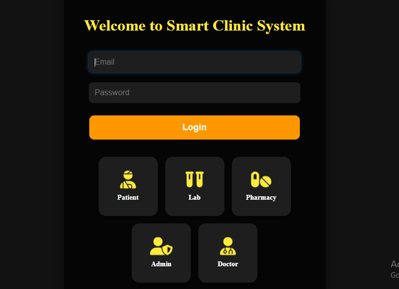
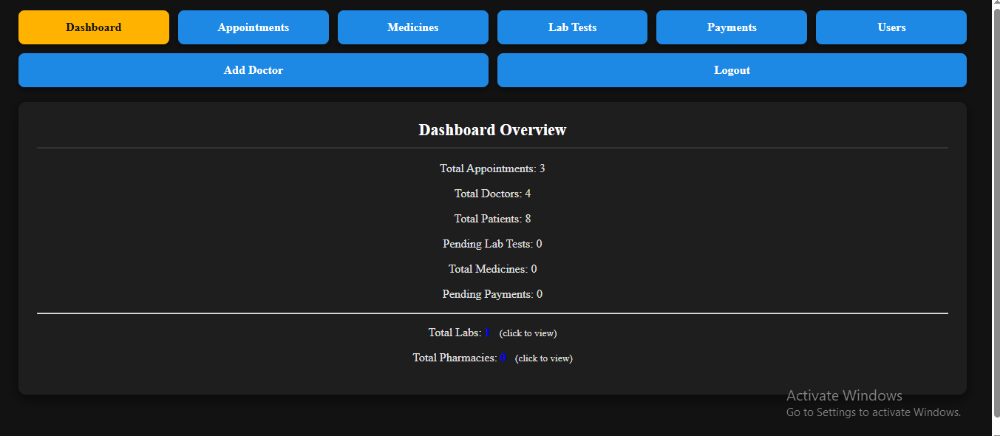
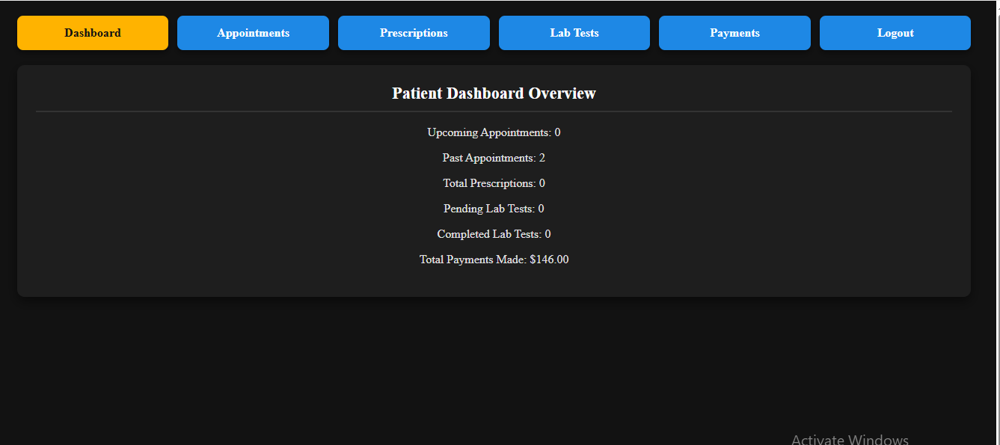
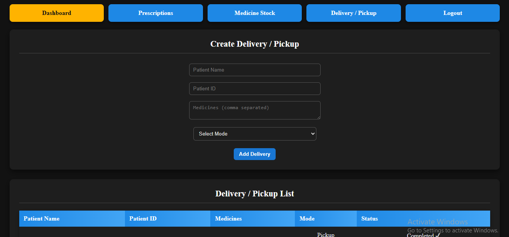
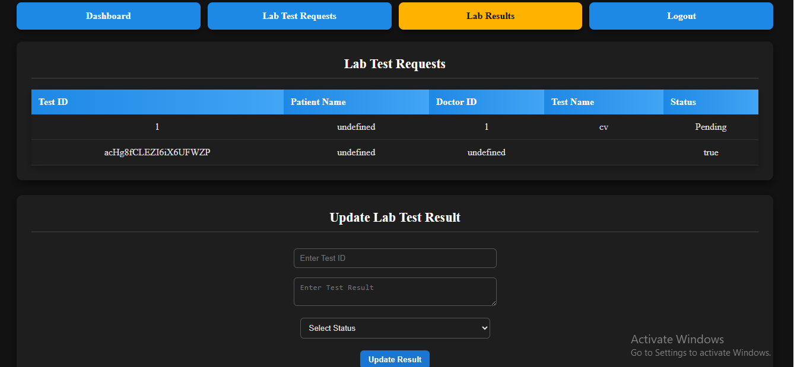
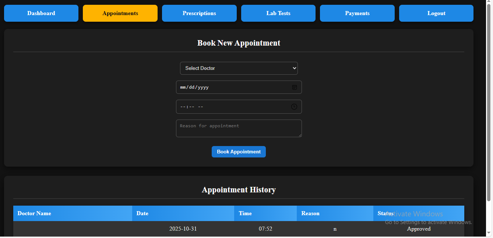
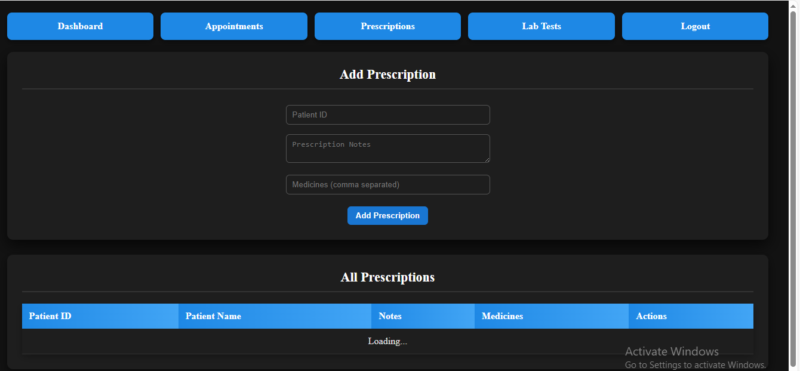
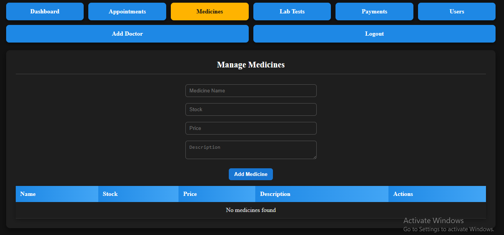
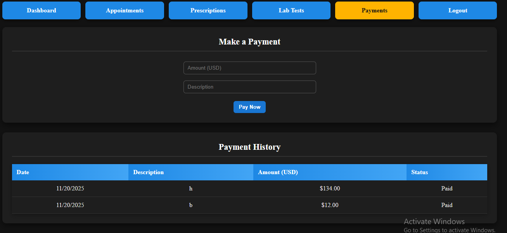

# 🏥 SmartClinicSystem (SCS) – Web-Based Clinic Management

---

## 🚀 Project Overview
**SmartClinicSystem (SCS)** is a web-based application designed to manage clinic operations efficiently, including **appointments, patient records, doctors’ schedules, pharmacy, lab tests, and payments**, all in one platform.  

**Purpose:**  
- Showcase full-stack development skills using **Firebase and JavaScript**  
- Provide a secure, interactive, role-based system for clinic management  
- Demonstrate database structure, CRUD operations, and dashboards for multiple roles  

**Live Demo:** [SmartClinicSystem](https://smartclinicsystem-218eb.web.app/)

---

## 🌟 Portfolio-Ready Highlights
- **Role-Based Access:** Separate dashboards for Admin, Doctor, Patient, Pharmacy, and Lab  
- **Dynamic CRUD Operations:** Manage appointments, prescriptions, medicines, lab tests, and payments  
- **Secure Authentication:** Role-based login ensures security and privacy  
- **Responsive UI:** Works across desktop and mobile screens  
- **Dashboard Interactivity:** Approve/reject appointments, add/edit medicines, view lab results  
- **Firebase Hosting:** Live deployment with real-time database updates  

---

## 🛠 User Roles & Access
| Role | Access & Features |
|------|------------------|
| Admin | Manage users, approve/reject appointments, medicines, lab tests, payments |
| Doctor | View schedule, approve appointments, add prescriptions, request lab tests |
| Patient | Book appointments, view prescriptions/lab results, make payments |
| Pharmacy | View prescriptions, update medicine stock, confirm deliveries |
| Lab | Manage lab test requests, update results, notify patients/doctors |

---

## 📸 Screenshots / Sections Overview
Here’s a visual walkthrough of the main sections of SmartClinicSystem:

| Section | Screenshot |
|---------|------------|
| Login Page |  |
| Admin Dashboard |  |
| Doctor Dashboard |  |
| Patient Dashboard |  |
| Pharmacy Dashboard |  |
| Lab Dashboard |  |
| Appointments Section |  |
| Prescriptions Section |  |
| Medicines Section |  |
| Payments Section |  |

> Each screenshot shows a **section or dashboard**, demonstrating layout, interactivity, and role-based features.

---

## 📖 Project Walkthrough
1. **Login Page** – Role-based login redirects to respective dashboards  
2. **Admin Dashboard** – Manage users, appointments, medicines, lab tests, payments  
3. **Doctor Dashboard** – Approve appointments, add prescriptions, request lab tests  
4. **Patient Dashboard** – Book appointments, view prescriptions/lab results, make payments  
5. **Pharmacy Dashboard** – Update medicine inventory, confirm orders  
6. **Lab Dashboard** – Manage lab requests, update results, notify patients/doctors  
7. **Sections Overview** – Appointments, Prescriptions, Medicines, Lab Tests, Payments  

---

## 🗄 Database Structure (Firebase Collections)
**Separate collections for each role and module:**  

| Collection | Key Fields |
|-----------|------------|
| admins | adminId, name, email, password, phone, role |
| patients | patientId, name, email, password, phone, dob, gender, role |
| doctors | doctorId, name, email, password, phone, specialization, availableDays, role |
| lab | labId, name, email, password, phone, role |
| pharmacy | pharmacyId, name, email, password, phone, role |
| appointments | appointmentId, patientId, doctorId, date, time, status, reason |
| prescriptions | prescriptionId, doctorId, patientId, medicines[], notes |
| medicines | medicineId, name, stock, price, description |
| labtests | testId, patientId, doctorId, testName, status, result |
| payments | paymentId, userId, amount, type, status, date |

---

## 🧠 Skills & Learnings
- Implemented **role-based access control** with Firebase Authentication  
- Built dashboards for **Admin, Doctor, Patient, Pharmacy, Lab**  
- CRUD operations across multiple collections  
- Real-time updates using **Firebase Firestore**  
- Designing responsive layouts and interactive dashboards  

---

## ⚡ Challenges & Solutions
**Challenges:**  
- Role-based interactivity and dashboard separation  
- Real-time updates for appointments, prescriptions, and payments  
- Secure authentication and data validation  

**Solutions:**  
- Firebase Authentication for secure login  
- Firestore collections for real-time updates  
- Validation and input sanitization for forms  

---

## 🔮 Future Enhancements
- Notification system (SMS/email alerts)  
- Reports for financial and operational data  
- Analytics dashboard for doctors and patients  
- Mobile app integration  
- Improved UI/UX for all dashboards  

---

## 🎉 Conclusion
**SmartClinicSystem** is a fully interactive, **role-based clinic management system**, demonstrating **front-end and back-end skills**, Firebase database management, and real-time web application functionality.  
It’s perfect for your **portfolio showcase** and demonstrates professional project deployment.

